(Gemaakt door: Thomas Van Beeck)

# Jumper ML-Agents oefening

## Inleiding

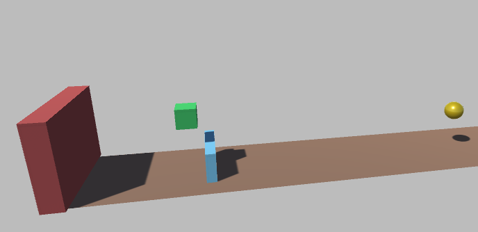

In deze ML-Agent 'Jumper' oefening gaat een kubus proberen om over muren (balken) te springen en eventueel ook nog enkele spheres (bollen) verzamelen om extra punten te krijgen. Het onnodig springen wordt afgestraft met een kleine vermindering van de punten en tegelijkertijd wordt het blijven stilstaan beloond met een kleine toevoeging van punten. De bedoeling is om de kubus zo lang mogelijk punten te laten verzamelen zonder dat deze een muur raakt. Van zodra er één muur geraakt is wordt de huidige training beëindigd. Het is dus van cruciaal belang om geen enkele muur te raken.

## Scene en objecten

- Maak een nieuwe scene aan en voeg volgende objecten toe:
    - Cube, naam: Agent, schaal: 1 : 1 : 1, positie: 5.5 : 0.5 : -6.5
    - Plane, naam: Ground, schaal:  0.5 : 1 : 3, positie: 5.5 : 0 : 2.5
    - Cube, naam: BackWall, schaal: 5.5 : 2 : -12, positie: 5.5 : 4 : 1
    - Empty, naam: WallSpawner, positie: 5.5 : 0.75 : 17
    - Empty, naam: RewardSpawner, positie: 5.5 : 2.25 : 17
- Creëer een Prefabs subfolder aan in de Assets folder
- Maak volgende objecten en voeg deze toe aan de Prefabs folder:
    - Empty, naam: COMPLETE, voeg hier alle andere elementen aan toe, buiten de main camera en belichting van de scene

    - Cube, naam: CollidingWall, schaal: 3 : 1.5 : 0.5, positie: 0 : 1.75 : 0
    - Sphere, naam: RewardSphere, schaal: 1 : 1 : 1, positie: 0 : 3.2 : 0

    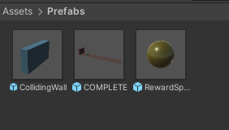
    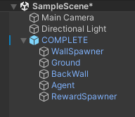

- Creëer volgende Tags en wijs ze toe aan het juiste object:
    - BackWall, toevoegen aan object BackWall
    - Agent, toevoegen aan Agent
    - CollidingWall, toevoegen aan CollidingWall (zie Prefabs folder)
    - CollisionReward, toevoegen aan RewardSphere (zie Prefabs folder)

## Rigidbody's en colliders

Voeg een Rigidbody component toe aan volgende componenten:
- BackWall

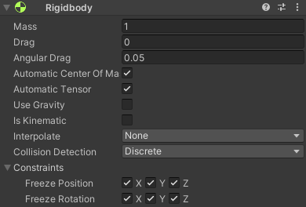  

- Agent

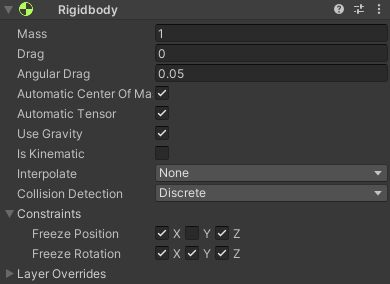

- CollidingWall (zie Prefabs folder)

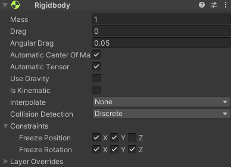

- RewardSphere (zie Prefabs folder)

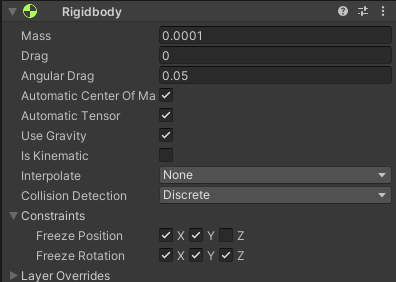

Controleer voor de zekerheid of deze objecten ook allemaal een collider hebben.
Allemaal Box colliders, behalve de RewardSphere. Deze heeft een Sphere collider.
Controleer ook of het  Ground object een Mesh collider heeft en voeg indien nodig toe.

### optioneel:
- Maak een subfolder in de Assets folder en noem deze Materials
- Maak enkele Materials aan met kleuren naar keuze en pas deze toe op de zichtbare componenten om een onderscheid te kunnen maken

    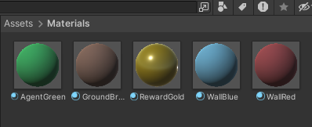

## Instellingen zwaartekracht

Om het springen over de muren kort en krachtig te laten verlopen moeten de standaardinstellingen worden aangepast van de zwaartekracht.
Dit kan via het menu Edit -> Project settings -> Gravity
Bovenaan pas je de settings van Gravity aan naar 0 : -40 : 0.

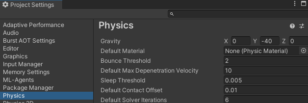

## Scripts (Classes)

Na het instellen en aanmaken van onze scene met bijbehorende objecten moeten we nog allerlei scripts gaan toevoegen.

### ObjectSpawner

Het ObjectSpawner script zorgt ervoor dat er willekeurig tussen twee tijdsintervallen objecten kunnen gespawned worden. Het heeft een public functie changeSpeed waarmee de snelheid kan worden aangepast. Deze snelheid wordt dan doorgegeven aan de objecten die gespawned worden. Op deze manier gaan deze bewegen tegen een bepaalde snelheid. Deze functie is public omdat na elke leerepisode de snelheid wordt aangepast. Meer info kan je vinden in het AgentObject script.

Voeg dit script toe aan het WallSpawner object met volgende settings:
- Object To Spawn: CollidingWall (zie Prefabs folder)
- Min Spawn Interval: 3
- Max Spawn Interval: 4
Voeg dit script toe aan het RewardSpanwer object met volgende settings:
- Object To Spawn: RewardSphere (zie Prefabs folder)
- Min Spawn Interval: 1
- Max Spawn Interval: 4

'''

    using UnityEngine;

    public class ObjectSpawner : MonoBehaviour
    {
        public GameObject objectToSpawn; // Het object dat moet worden gespawned
        public float minSpawnInterval = 1f; // Minimale tijd tussen spawns
        public float maxSpawnInterval = 2f; // Maximale tijd tussen spawns
        private float moveSpeed;

        private float nextSpawnTime; // Tijd wanneer het volgende object wordt gespawned

        void Start()
        {
            // Initialiseer de volgende spawn tijd
            nextSpawnTime = Time.time + Random.Range(minSpawnInterval, maxSpawnInterval);
        }

        void Update()
        {
            // Controleer of het tijd is om een object te spawnen
            if (Time.time >= nextSpawnTime)
            {
                SpawnObject();
                // Bereken de volgende spawn tijd
                nextSpawnTime = Time.time + Random.Range(minSpawnInterval, maxSpawnInterval);
            }
        }

        public void changeSpeed()
        {
            // Deze functie wordt elke keer opgeroepen als er een nieuwe leerepisode begint
            // Deze functie is daarom dus ook public, zodat AgentObject deze functie kan in gang zetten
            // bij het begin van elke nieuwe leerepisode van ML-Agent
            moveSpeed = Random.Range(6f, 12f);
            Debug.Log("Muren snelheid: " + moveSpeed);
        }

        void SpawnObject()
        {
            // Spawn het object op de positie van de spawner
            GameObject newObject = Instantiate(objectToSpawn, transform.position, Quaternion.identity);
            Moving movingComponent = newObject.GetComponent<Moving>();

            // Controleer of de Moving-component is gevonden
            if (movingComponent != null)
            {
                // Stel de snelheid in
                movingComponent.speed = moveSpeed;
            }
        }
    }

'''

### Moving

Dit script gaat de gespawnde muren laten bewegen en de juiste beloningsfunctionaliteit triggeren.
Bij een collision zal de muur ook verdwijnen.

Voeg dit script toe aan het CollidingWall object met volgende settings:
- Speed: 7

'''

    using UnityEngine;

    public class Moving: MonoBehaviour
    {
        public float speed = 5f; // Stel hier de gewenste snelheid in
        private AgentObject agent;
        private Rigidbody rb;

        void Start()
        {
            agent = FindObjectOfType<AgentObject>();
            rb = GetComponent<Rigidbody>();
            rb.velocity = transform.forward * speed * -1f; // Hier wordt de snelheid ingesteld in de voorwaartse richting van het object
        }

        private void OnCollisionEnter(Collision collision)
        {
            if (collision.gameObject.CompareTag("BackWall"))
            {
                agent.WallSuccess();
                Destroy(gameObject);
            }
        }
    }

'''

### MovingSphere

Gelijkaardig aan het vorige script, maar met enkele kleine verschillen voor het triggeren van de juiste beloning.

Dit script gaat de gespawnde spheres laten bewegen en de juiste beloningsfunctionaliteit triggeren.
Bij een collision zal de sphere ook verdwijnen.

Voeg dit script toe aan het RewardSphere object met volgende settings:
- Speed: 5

'''

    using UnityEngine;

    public class MovingSphere : MonoBehaviour
    {
        public float speed = 5f; // Stel hier de gewenste snelheid in
        private AgentObject agent;
        private Rigidbody rb;

        void Start()
        {
            agent = FindObjectOfType<AgentObject>();
            rb = GetComponent<Rigidbody>();
            rb.velocity = transform.forward * speed * -1f; // Hier wordt de snelheid ingesteld in de voorwaartse richting van het object
        }

        private void OnCollisionEnter(Collision collision)
        {
            if (collision.gameObject.CompareTag("Agent"))
            {
                Debug.Log("Object geraakt dat een beloning oplevert.");
                agent.BonusPoints(2.5f);
            }
            Debug.Log("destroy SPHERE");
            Destroy(gameObject);
        }
    }

'''

### AgentObject

Dit script gaat de ML-Agents functionaliteit toevoegen aan de kubus.
Bij elke nieuwe leerepisode gaat deze onnodige objecten vernietigen, de kubus terug op zijn startpositie zetten, de nieuwe snelheid aan de ObjectSpawners doorgeven, ...
Welke parameters geobserveerd moeten worden tijdens de trainingen: Y velocity waarde en Y positie van de kubus.
Een mechanisme dat gaat controleren of er al een tijdje niet is gesprongen en hoe snel je achter elkaar kan springen limiteren.
De functionaliteit om het object te laten springen, alsook in heuristic modus zodat men met de spatiebalk zelf ook kan springen.
Verder ook al de juiste rewards:
- krijg punten voor het 'niet' springen
- krijg punten voor het colliden met een sphere
- krijg punten wanneer een muur de achterste muur heeft bereikt
- verlies punten per sprong
- verlies veel punten bij het colliden met een muur (en einde episode)

Voeg dit script toe aan het Agent object met volgende settings:
- Max Step: 5000
- Jump Force: 14.5
- Nojump Reward: 0.05
- Time Between Jumps: 0.75
- Wall Spawner: WallSpawner
- Reward Spawner: RewardSpawner
- No Jump Reward Interval: 0.2

'''

    using System.Collections.Generic;
    using UnityEngine;
    using Unity.MLAgents;
    using Unity.MLAgents.Sensors;
    using Unity.MLAgents.Actuators;

    public class AgentObject : Agent
    {
        Rigidbody rBody;
        private Vector3 startPos;
        private Quaternion startRot;
        public float jumpForce = 3f;
        public float nojumpReward = 0.01f;
        private bool canJump = true;
        private float lastJumpTime;
        public float timeBetweenJumps = 0.8f;
        public ObjectSpawner wallSpawner;
        public ObjectSpawner rewardSpawner;
        private float totalReward = 0f;
        public float noJumpRewardInterval = 0.25f; // Interval in seconden voor het toekennen van de no jump beloning
        private float timeSinceLastJump = 0f; // Timer voor bijhouden van tijd sinds de laatste sprong

        void Start()
        {
            // rigidbody van de agent zelf
            rBody = GetComponent<Rigidbody>();
            // beginpositie bewaren, zodat we er na einde episode terug naar kunnen resetten
            startPos = transform.position;
            startRot = transform.rotation;
            lastJumpTime = -1000f; // Initialiseren met een negatieve waarde om ervoor te zorgen dat er meteen kan worden gesprongen
        }

        public override void OnEpisodeBegin()
        {
            // reward tellen vuur te loggen terug op nul zetten
            totalReward = 0f;
            // al de gespawnde muren vernietigen
            // zoek alle objecten met de tag "CollidingWall"
            GameObject[] walls = GameObject.FindGameObjectsWithTag("CollidingWall");

            // loop door alle gevonden objecten en vernietig ze
            foreach (GameObject wall in walls)
            {
                Destroy(wall);
            }
            // al de gespawnde reward spheres vernietigen
            // zoek alle objecten met de tag "CollisionReward"
            GameObject[] spheres = GameObject.FindGameObjectsWithTag("CollisionReward");

            // loop door alle gevonden objecten en vernietig ze
            foreach (GameObject sphere in spheres)
            {
                Destroy(sphere);
            }

            // nieuwe snelheid van de muren door de spawner laten bepalen
            wallSpawner.changeSpeed();
            rewardSpawner.changeSpeed();

            // positie, rotatie en eventuele bewegingskrachten resetten van de agent
            rBody.velocity = Vector3.zero;
            rBody.angularVelocity = Vector3.zero;
            transform.position = startPos;
            transform.rotation = startRot;
            canJump = true;
        }

        public override void CollectObservations(VectorSensor sensor)
        {
            // we observeren de lokale positie en de velocity op de rigidbody (y as)
            sensor.AddObservation(this.transform.localPosition.y);
            sensor.AddObservation(rBody.velocity.y);
        }

        public override void OnActionReceived(ActionBuffers actionBuffers)
        {
            // controleren of de 'AI' wil springen
            bool jumpAction = actionBuffers.DiscreteActions[0] == 1;
            //Debug.Log(Time.time - lastJumpTime);
            // Controleren of de agent mag springen en vervolgens springen
            if (jumpAction && canJump)
            {
                Jump();
                canJump = false;
                lastJumpTime = Time.time;
            }
            if (!canJump && (Time.time - lastJumpTime > timeBetweenJumps))
            {
                canJump = true;
            }
            timeSinceLastJump += Time.deltaTime;

            // Belonen om NIET te springen als de agent kan springen
            if (canJump && timeSinceLastJump >= noJumpRewardInterval)
            {
                AddReward(nojumpReward);
                totalReward += nojumpReward;
                Debug.Log("REWARD TOTAAL = " + totalReward);
                timeSinceLastJump = 0f; // Reset de timer
            }

        }

        public void BonusPoints(float points)
        {
            AddReward(points);
            totalReward += points;
            Debug.Log("REWARD TOTAAL = " + totalReward);
        }

        public void Jump()
        {
            Debug.Log("Jumped!");
            rBody.AddForce(Vector3.up * jumpForce, ForceMode.Impulse);
            AddReward(-0.2f); // afstraffing voor springen
            totalReward -= 0.2f;
            Debug.Log("REWARD TOTAAL = " + totalReward);
        }

        void OnCollisionEnter(Collision collision)
        {
            // Controleer of het object waarmee wordt gebotst de juiste tag heeft
            if (collision.gameObject.CompareTag("CollidingWall"))
            {
                Debug.Log("Oeps! Botsing met een muur.");
                AddReward(-10f);
                totalReward -= 10f;
                Debug.Log("REWARD TOTAAL = " + totalReward);
                EndEpisode();
            }
        }

        public void WallSuccess()
        {
            Debug.Log("Een muur heeft succesvol de eindmuur bereikt.");
            AddReward(2f);
            totalReward += 2f;
            Debug.Log("REWARD TOTAAL = " + totalReward);
        }

        public override void Heuristic(in ActionBuffers actionsOut)
        {
            var discreteActionsOut = actionsOut.DiscreteActions;
            // Controleren of de spatiebalk wordt ingedrukt en of de agent kan springen
            discreteActionsOut[0] = Input.GetKey(KeyCode.Space) ? 1 : 0;
        }
    }
'''

### Behavior Parameters, Decision Requester & Ray Perception Sensor 3D

Voeg aan het Agent object deze scripts toe met volgende settings:

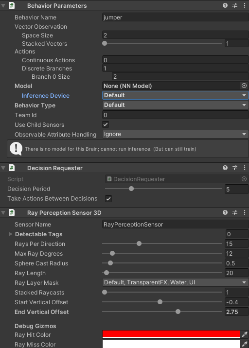

## Leerresultaat

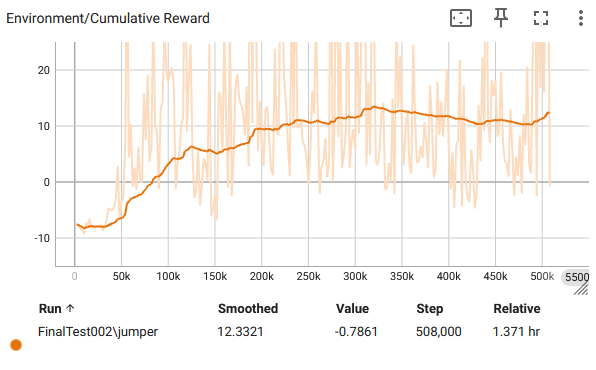

Dit is het resultaat na meer dan 500 000 stappen. De kubus wordt in het begin streng gestraft omdat het nog moest leren om over elke muur te springen. Na verloop van tijd is er opmerkelijk verbetering en slaagt de kubus er ook in om extra punten te verkrijgen door niet te vaak onnodig te springen en ook spheres te verzamelen. Vanaf stap 200 000 is er wel nog weinig verbetering te merken.